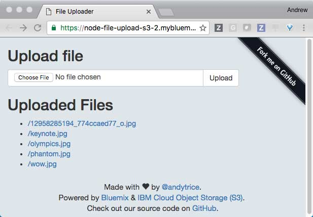

# node-file-upload-S3
Sample/demo node file uploader IBM Cloud Object Storage S3 bucket

## Node file uploader for Cloud Object Storage (S3) using Pipes and Streams

This is an example application which can be run on Bluemix.
This application showcases how to pipe files from a multi-part form using streams to an IBM Cloud Object Storage S3 bucket. By using pipes and streams, you do not chew up disk space or memory.

### Build status


### Sign Up for IBM Bluemix 

If you do not already have a Bluemix account, you'll need to register for one here: https://console.ng.bluemix.net/registration/
*(you can sign up for free!)*

### Sign Up for IBM Cloud Object Storage

You will need an <a href="https://www.ibm.com/cloud-computing/products/storage/object-storage/">IBM Cloud Object Storage</a> S3 bucket to save your files into.  
You can sign up for the S3 API (free trial or paid service) directy at: https://www.softlayer.com/Store/orderService/objectStorage 

Be sure to select the **"Cloud Object Storage - S3 API"** option. 

Once your account is created you will need to create an S3 bucket under: https://control.softlayer.com/storage/objectstorage 

### Deploy Manually as follows:

1. Clone the app (i.e. this repo)

  ```
  git clone https://github.com/IBM-Bluemix/node-file-upload-S3
  cd node-file-upload-S3
  ```

2. Open the file `s3-credentials.json` and enter your S3 authentication credentials.  You can find your authentication credentials by going to https://control.softlayer.com/storage/objectstorage then clicking the *"View Credentials"* link. 

  ``` 
{
    "key":"YOUR_KEY_HERE",
    "secret":"YOUR_SECRET_HERE",
    "bucket":"YOUR_BUCKET_NAME_HERE",
    "endpoint":"s3-api.us-geo.objectstorage.softlayer.net"
}  
```

3. Edit the manifest.yml file.  Change the 'name' attribute to something unique.

4. Push to Bluemix with the updated `manifest.yml`.

  ```
  cf push
  ```

  Once deployed, Access your application URL in the browser.  You should see the main page and be able to navigate the links.

  

### Privacy Notice

The Personality Box sample web application includes code to track deployments to Bluemix and other Cloud Foundry platforms. The following information is sent to a [Deployment Tracker] [deploy_track_url] service on each deployment:

* Application Name (`application_name`)
* Space ID (`space_id`)
* Application Version (`application_version`)
* Application URIs (`application_uris`)

This data is collected from the `VCAP_APPLICATION` environment variable in IBM Bluemix and other Cloud Foundry platforms. This data is used by IBM to track metrics around deployments of sample applications to IBM Bluemix. Only deployments of sample applications that include code to ping the Deployment Tracker service will be tracked.

### Disabling Deployment Tracking

Deployment tracking can be disabled by removing `require("cf-deployment-tracker-client").track();` from the beginning of the `server.js` main server file.

[deploy_track_url]: https://github.com/cloudant-labs/deployment-tracker